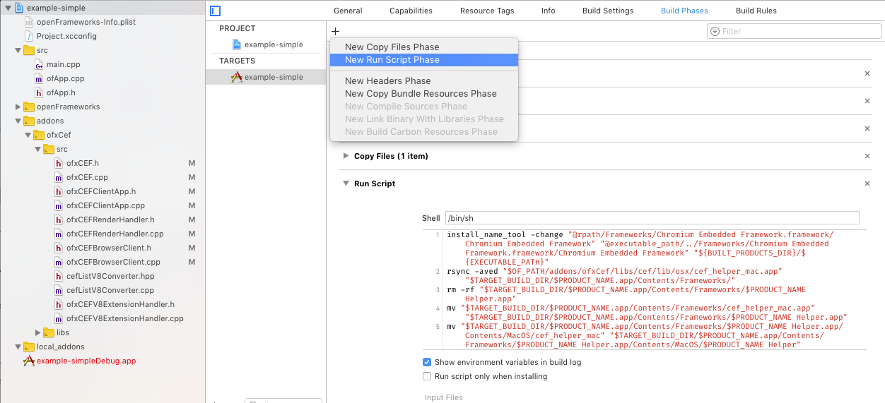
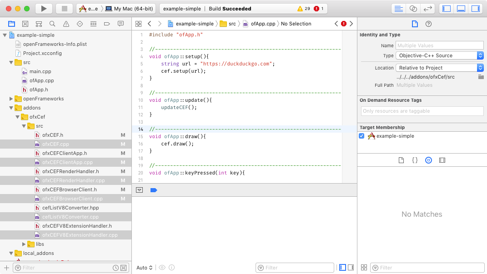
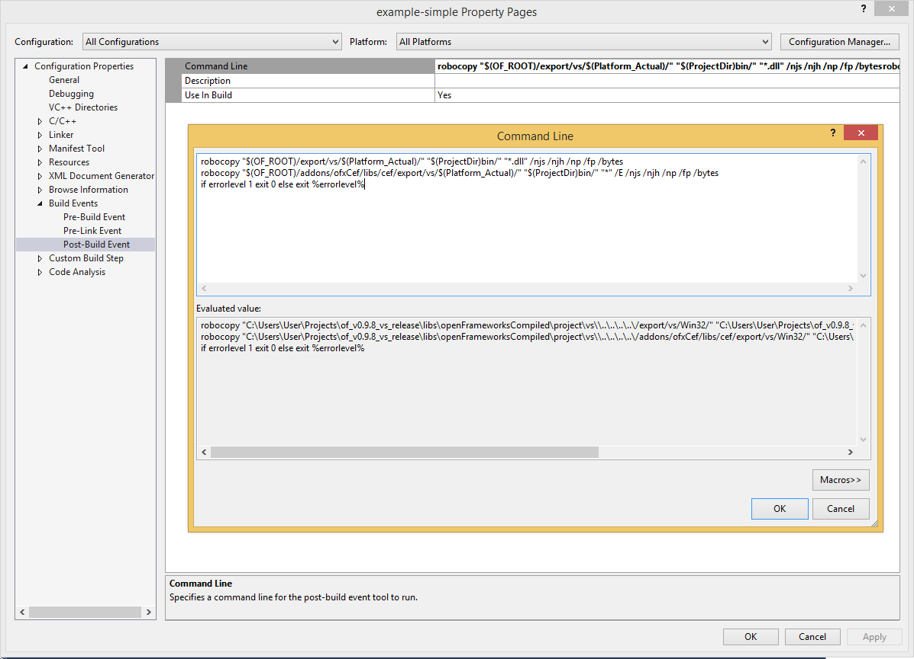

# ofxCEF

An attempt to get CEF working in openframeworks as an alternative to awesomium, berkelium, etc. [More info on CEF](https://bitbucket.org/chromiumembedded/cef) [wiki](https://bitbucket.org/chromiumembedded/cef/wiki/Home)


## Installation

The CEF library is not directly included in the addon. The reason for this is a combination of two factors: The CEF source changes quite often and the build is quite big (min 100 mb). So to stay up-to-date ofxCEF would often need to include a new CEF build, which would make this repository very large.

To avoid this the CEF library has to build manually. Luckily there is a [apothecary](https://github.com/openframeworks/apothecary) (already included in OF) script to automate this process.

### macOS – Xcode

Tested with Xcode 9.2, macOS High Sierra 10.13.2, of_v0.9.8 – 64 Bit Build

**Requirements**

`cmake` install with [brew](https://brew.sh):
  
```bash
brew install cmake
```

**Setup**

```bash
cd of_v0.9.8_osx_release/scripts/apothecary/
./apothecary update ofxCef
```

This will download, build and setup the directory structure for the CEF library.
The script will download the builds from [Automated Builds from Spotify](http://opensource.spotify.com/cefbuilds/index.html). You can set the version `VER` in `scripts/formulas/cef.sh`.


Now you can use the examples or the ProjectGenerator.

**ProjectGenerator**

After creating a new project with the ProjectGenerator you have to do a few simple manual steps:

1. In the project settings go to Build Phases. There we need another `Run Script` build phase. Press the `+` then `New Run Script Phase`. In there goes:

	```
	install_name_tool -change "@rpath/Frameworks/Chromium Embedded Framework.framework/Chromium Embedded Framework" "@executable_path/../Frameworks/Chromium Embedded Framework.framework/Chromium Embedded Framework" "${BUILT_PRODUCTS_DIR}/${EXECUTABLE_PATH}"
	rsync -aved "$OF_PATH/addons/ofxCef/libs/cef/lib/osx/cef_helper_mac.app" "$TARGET_BUILD_DIR/$PRODUCT_NAME.app/Contents/Frameworks/"
	rm -rf "$TARGET_BUILD_DIR/$PRODUCT_NAME.app/Contents/Frameworks/$PRODUCT_NAME Helper.app"
	mv "$TARGET_BUILD_DIR/$PRODUCT_NAME.app/Contents/Frameworks/cef_helper_mac.app" "$TARGET_BUILD_DIR/$PRODUCT_NAME.app/Contents/Frameworks/$PRODUCT_NAME Helper.app"
	mv "$TARGET_BUILD_DIR/$PRODUCT_NAME.app/Contents/Frameworks/$PRODUCT_NAME Helper.app/Contents/MacOS/cef_helper_mac" "$TARGET_BUILD_DIR/$PRODUCT_NAME.app/Contents/Frameworks/$PRODUCT_NAME Helper.app/Contents/MacOS/$PRODUCT_NAME Helper"
	```
	
	
	
4. On the left in the source tree select now each `.cpp` file in `addons/ofxCef/src` and set the type in the file inspector to `Objective-C++ Source`.
	
	
	
**Note on the `cef_helper_mac`**

If you change any of the following sources you have to rebuild the `cef_helper_mac`:

- `process_helper_mac.cpp`
- `ofxCEFClientApp.cpp/.h`
- `ofxCEFV8ExtensionHandler.cpp/.h`
- `cefListV8Converter.cpp/.hpp`


<br />

### Windows – Visual Studio

Tested with VS 2015, Windows 8.1 Pro, of_v0.9.8 – 64 Bit Build

**Requirements**

`cmake` install from [here](https://cmake.org/download/)
 
`git shell` install from [here](https://git-scm.com/download/win). Check `Git Bash Here` within `Windows Explorer integration` when asked in the installation process.

**Setup**

Navigate to `of_v0.9.8_osx_release/scripts/apothecary/` then right click in the Explorer and select `Git Bash Here`. Then use this command:

```bash
./apothecary update ofxCef
```

This will download, build and setup the directory structure for the CEF library.
The script will download the builds from [Automated Builds from Spotify](http://opensource.spotify.com/cefbuilds/index.html). You can set the version `VER` in `scripts/formulas/cef.sh`.

Now you can use the examples or the ProjectGenerator.

**ProjectGenerator**

After creating a new project with the ProjectGenerator you have to do one simple manual step:

Open the project properties, change `Configuration` to `All Configurations` and `Platforms` to `All Platforms`. In `Build Events` > `Post-Build Event` set `Command Line` with <Edit…> to:
    
```
robocopy "$(OF_ROOT)/export/vs/$(Platform_Actual)/" "$(ProjectDir)bin/" "*.dll" /njs /njh /np /fp /bytes
robocopy "$(OF_ROOT)/addons/ofxCef/libs/cef/export/vs/$(Platform_Actual)/" "$(ProjectDir)bin/" "*" /E /njs /njh /np /fp /bytes
if errorlevel 1 exit 0 else exit %errorlevel%
```



<br />

### Cleaning up

The apothecary build directory still contains the CEF sources from which the CEF library is build. If you want to clean that up and get some disk space back you can use: 

```bash
./apothecary remove ofxCef
```

<br />

### Updating CEF library

If you want to update to the latest CEF library you first also need to delete the old CEF sources (so apothecary won't skip the download of the new version):

```bash
./apothecary remove ofxCef
```

Then you need to set the `VER` variable in `scripts/formulas/cef.sh` to the version you want to use from [Automated Builds from Spotify](http://opensource.spotify.com/cefbuilds/index.html). After that you need to rerun:

```bash
./apothecary update ofxCef
```


<br />
<br />

## Usage


### Minimal

`main.cpp`

Add `initofxCEF()` before and `CefShutdown()` after the existing code:

```cpp
int main( ){
    
    int argc = 0;
    char** argv = NULL;
    initofxCEF(argc, argv);


    ofSetupOpenGL(1024,768,OF_WINDOW);      // <-------- setup the GL context

    // this kicks off the running of my app
    // can be OF_WINDOW or OF_FULLSCREEN
    // pass in width and height too:
    ofRunApp(new ofApp());


    CefShutdown();
}
```


`ofApp.h`

add `#include "ofxCEF.h"` and an ofxCef instance `ofxCEF cef`:

```cpp
#include "ofMain.h"
#include "ofxCEF.h"

class ofApp : public ofBaseApp{

    …

    ofxCEF cef;
};
```


`ofApp.cpp`

```cpp
//--------------------------------------------------------------
void ofApp::setup(){
    string url = "https://duckduckgo.com";
    cef.setup(url);
}

//--------------------------------------------------------------
void ofApp::update(){
    updateCEF();
}

//--------------------------------------------------------------
void ofApp::draw(){
    cef.draw();
}
```

<br />

### Communicate with JS

See the `example-communication` for further info.

**Send data to JS**

```cpp
cef.executeJS("dataFromOF(\"keyReleased in OF: " + ofToString(key) + "\")");
```


**Bind JS function to method in OF**

```cpp
cef.bind("dataToOF", this, &ofApp::gotMessageFromJS);
```


<br />
<br />

## Examples

* **Simple:** Just the minimum needed to load and view a page
* **Multi:** Tech demo creating many instances (might helpful to find bugs)
* **Communication:** How to send and receive data from a page (JS)


<br />
<br />

## Known Issues
	
- CEF hijacks the menu bar and makes it unusable, among other things cmd+q isn't working anymore (macOS only).
